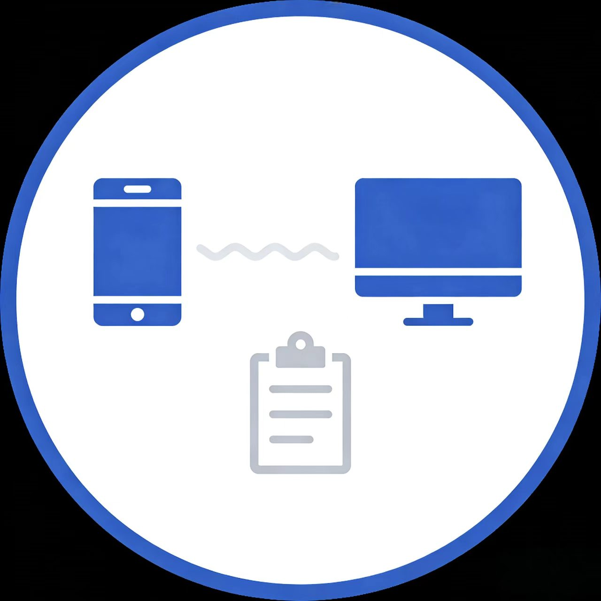
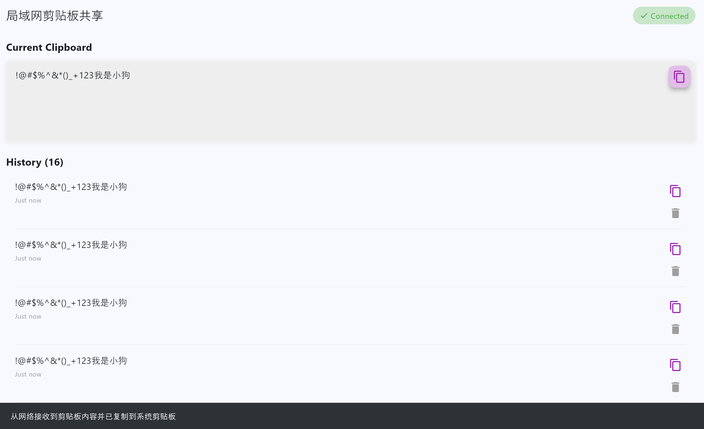

# 局域网剪贴板同步工具 (LAN Clipboard Sync)


一款基于 Flutter 构建的轻量级跨平台局域网剪贴板同步工具。致力于解决 Windows PC 端与 Android 移动端在同一局域网下的文本快速共享痛点。

## 🌟 核心特性 (Features)

* **局域网设备自动发现 (Auto-Discovery)**
  * 基于 UDP 广播机制，设备接入同一局域网即可自动发现彼此，无需手动输入 IP 或进行繁琐的配对。
* **Active-Sync 前台唤醒同步 (Focus-Triggered Sync)**
  * **PC -> 手机**：在 Windows 端任意位置复制文本后，手机端打开或切换至本应用时，即可自动抓取网络数据并无缝写入 Android 系统剪贴板。
  * **手机 -> PC**：在手机端全局复制文本后，切回本应用即可自动触发网络请求，将内容推送至 PC 剪贴板。
* **双端环境网络保活与穿透 (Keep-Alive & Firewall Bypass)**
  * **Android 端**：原生接入 Kotlin 编写的 Foreground Service (前台服务)，确保应用切至后台时网络 Socket 依然保持存活，抵抗系统休眠机制 (Doze)。
  * **Windows 端**：引入 HTTP 反向 IP 记录机制 (Reverse IP Mapping)，智能穿透 Windows 防火墙默认的 UDP 广播拦截，保障双向通信的稳定性。
* **剪贴板历史记录 (History Track)**
  * 本地记录同步历史，支持随时回溯、一键重新复制或删除。

## 🛠️ 技术栈 (Tech Stack)

* **跨平台框架**: Flutter, Dart
* **移动端原生支持**: Kotlin, Android SDK (Foreground Service API)
* **桌面端原生支持**: C++, Windows API
* **网络传输层**: 
  * `UDP` (用于局域网广播与设备心跳发现)
  * `HTTP/TCP` (用于稳定可靠的剪贴板长文本传输)

## ⚠️ 系统权限与架构设计说明 (System Limitations & Design Choices)

本项目采用了 **Active-Sync (前台激活同步)** 模式，而非后台静默全局监听同步。这是基于当代移动端操作系统底层隐私限制的深思熟虑之举：

1. **Android 10+ 隐私限制**：自 Android 10 (API Level 29) 起，系统彻底封锁了后台应用对全局剪贴板 (`ClipboardManager`) 的读取权限。即使存在前台服务，应用切入后台后调用剪贴板 API 也会被静默拦截并返回 null。
2. **后台写入拦截**：部分定制 Android 系统同样限制了处于后台的应用直接修改系统剪贴板。
3. **我们的折中哲学**："切回应用即触发同步" 既严格遵守了操作系统的安全与隐私沙盒规范，避免了应用被判定为过度获取权限的风险，同时也极大程度降低了后台持续轮询带来的设备性能消耗与耗电。

## 🚀 快速运行 (Getting Started)

### 环境要求
* Flutter SDK >= 3.18.0
* Android Studio (用于 Android 侧编译)

### 编译与运行
```bash
# 获取代码
git clone https://gitee.com/ChongXu-dev/LAN-synchronization.git
cd LAN-synchronization

# 获取依赖
flutter pub get

# 运行 Android 端
flutter run -d android

# 运行 Windows 桌面端
flutter run -d windows
```

## 📸 运行截图 (Screenshots)

### Android 端界面


### Windows 端界面


## 📄 开源协议 (License)

本项目采用 MIT 协议开源，详见 [LICENSE](LICENSE) 文件。

## 🤝 贡献与反馈 (Contributing)

欢迎提交 Issue 和 Pull Request！如果您有任何建议或发现问题，请通过以下方式联系我们：

* Gitee Issues: https://gitee.com/ChongXu-dev/LAN-synchronization/issues
* GitHub Issues: https://github.com/ChongXu-dev/LAN-synchronization/issues

---

**Active-Sync Edition** - 让剪贴板同步更简单、更智能！
